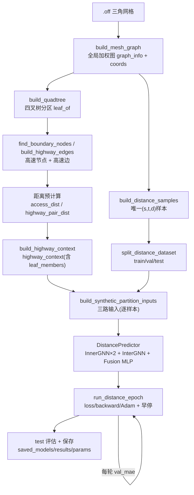

# NeurSC 距离回归 —— 完整流程文档

本文件完整描述从**输入地形网格**开始，经**建图 → 四叉树分区 → 高速骨干派生 → 距离监督采样 →
三路输入构造 → 三段式 GNN 前向 → 训练/早停/保存**的端到端流程，并给出流程树状图。
内容以当前代码为准（`.off` 输入 + 真正的四叉树 + Inner-GNN 吃分区子图）。

---

## 0. 一句话概览

> 给定一张地形三角网格 `.off`，把它变成带权图，用**四叉树**切成若干叶子盒（分区），盒子边界上的
> 顶点构成**高速骨干网络**；从图上采样节点对 `(s, t)` 并用 Dijkstra 算真实最短路作为监督；
> 模型把「s 的分区子图、t 的分区子图、s/t 在高速图上的跨区表示」三路信息融合，回归出 `d̃(s, t)`。

涉及文件：

| 文件 | 职责 |
|---|---|
| `build_highway.py` | `.off` 读取、建图、**四叉树分区**、高速骨干派生、端到端入口 `build_pipeline_inputs` |
| `preprocess.py` | 距离样本采样/切分、特征构造、`build_highway_context`、三路输入构造 |
| `gnn.py` | `InnerGNN` / `InterGNN` / `DistancePredictor`（三段式模型） |
| `model.py` | `DistanceRegressionNet`（包装）+ `compute_distance_metrics` |
| `main.py` | 训练主循环（损失、早停、保存） |
| `infer_distance.py` | 单对顶点推理 |

---

## 1. 流程树状图

```
NeurSC 训练流程
│
├─[输入] sample_terrain.off  (2-manifold 三角网格: 顶点 x y z + 三角面)
│
├─① 建立全局图  build_highway.build_mesh_graph()
│     ├─ 节点 = 网格顶点
│     ├─ 边   = 网格边（三角形三条边去重，双向）
│     ├─ 边权 = 顶点间 3D 欧氏距离
│     └─ 产出: graph_info[ids,labels,degree,[eu,ev],ew,neighbors,label_dict] + coords{(x,y)}
│
├─② 四叉树分区  build_highway.build_quadtree()
│     ├─ 用 (x,y) 包围盒递归四分: SW / SE / NW / NE
│     ├─ adaptive(默认): 盒内点数>capacity 且 深度<max_depth 才继续四分
│     ├─ uniform(--uniform): 一律分到 max_depth (4^depth 个等大叶子)
│     └─ 产出: leaf_of{node->leaf_id}, num_leaves
│
├─③ 高速骨干派生  build_highway.find_boundary_nodes() / build_highway_edges()
│     ├─ 高速(边界)节点 = 有"跨叶子邻边"的顶点  (对应 EAR-Oracle boundary_points)
│     ├─ 高速边 = 原始跨界边 ∪ 盒内 boundary→boundary 全图最短路(transit 边)
│     └─ 产出: boundary_sorted(高速节点), edge_w(高速边)
│
├─④ 距离预计算  (build_pipeline_inputs 内)
│     ├─ dist_from_boundary: 从每个高速节点跑一次 Dijkstra(全图)
│     ├─ access_dist[node][k]   = 每个图节点到第 k 个高速入口的图最短路
│     └─ highway_pair_dist[i][j] = 高速图内部两两最短路
│
├─⑤ 组装高速上下文  preprocess.build_highway_context()
│     └─ 张量化 x_highway / edge_index_highway + FeatureBuilder + 叶子成员 leaf_members
│        + 缓存槽 inner_cache  →  highway_context(dict)
│        【①~⑤ 由 build_highway.build_pipeline_inputs() 一次性完成】
│
├─⑥ 采样监督样本  preprocess.build_distance_samples()
│     ├─ 无放回抽样唯一 (s,t) 对(默认 undirected, 即 s<t)
│     ├─ 按源点分组, 每个不同源点只跑一次 Dijkstra → 读真实最短路 d(s,t)
│     └─ 产出: [{"s","t","distance"}, ...]   (唯一, 无重复)
│
├─⑦ 数据切分  preprocess.split_distance_dataset()
│     └─ shuffle 后按 8:1:1 切 train / val / test  (输入已去重 → 无跨集泄漏)
│
├─⑧ 逐样本构造三路输入  preprocess.build_synthetic_partition_inputs()
│     │   (训练循环里对每个样本调用一次)
│     ├─ Inner-s: _build_inner_subgraph(s) → s 所在叶子盒诱导子图 (缓存复用)
│     │            → x_s[Ns,F], edge_index_s[2,Es], s_idx
│     ├─ Inner-t: 同理 → x_t, edge_index_t, t_idx
│     ├─ Inter  : 高速图 + s/t 全局坐标特征 + 各自最近 k 个高速入口
│     │            → x_highway, edge_index_highway, s_global_feat[2], t_global_feat[2],
│     │              s_connect_idx, t_connect_idx
│     └─ 距离特征: highway_dist_feat = log1p([access_s, seg, access_t, sum])  [4]
│
├─⑨ 三段式前向  model.DistanceRegressionNet → gnn.DistancePredictor
│     ├─ InnerGNN(GraphSAGE) × 2  → h_s_inner[1,O], h_t_inner[1,O]
│     ├─ InterGNN(GraphSAGE+虚拟节点) → st_virtual_emb[1,2O]  (s/t 两块)
│     ├─ 融合 = cat([h_s_inner, h_t_inner, st_virtual_emb, (highway_dist_feat)])
│     └─ Fusion MLP + Softplus → ŷ = d̃(s,t)  (非负标量)
│
├─⑩ 训练循环  main.run_distance_epoch() / build_loss()
│     ├─ 损失: log_l1(默认) / l1 / relative / huber
│     ├─ 逐样本 forward → loss → backward → Adam.step
│     ├─ 每轮算 train/val 的 mae/rmse/relative_error
│     └─ 按 val_mae 早停 (early_stop_patience), 记录最佳权重
│
└─⑪ 评估与保存  main.py 末尾
      ├─ 用最佳权重在 test 集评估 (mae/rmse/relative_error)
      ├─ saved_models/<name>.pt    (模型权重)
      ├─ saved_results/<name>.txt  (指标)
      └─ saved_params/<name>.txt   (运行参数快照)
```

---

## 2. 各阶段详解

### 阶段 ①：输入 .off → 全局图
- 入口：`build_highway.load_off(path)` → `(vertices, faces)`。鲁棒解析 `OFF` 头与计数行。
- `build_highway.build_mesh_graph(vertices, faces)`：
  - 节点 = 顶点；边 = 每个三角面的三条边（去重、双向存储）；
  - **边权 = 两端点的 3D 欧氏距离**（这样图最短路 ≈ 沿网格的折线测地距离）；
  - 顶点 `(x, y)` 作为坐标 `coords`，用于分区与位置特征（`z` 暂不进特征）。
- 产物 `graph_info = [ids, labels(全 0), degree, [edge_u, edge_v], edge_w, neighbors, label_dict]`。

### 阶段 ②：四叉树分区（对齐论文 G1~G4）
- 入口：`build_highway.build_quadtree(coords, max_depth, capacity, adaptive)`。
- 每个盒子按中点四分为 **SW/SE/NW/NE**，递归：
  - **adaptive（默认）**：仅当盒内点数 `> capacity` 且深度 `< max_depth` 才继续四分（叶子大小不均，真正的自适应四叉树）；
  - **uniform（`--uniform`）**：一律分到 `max_depth`，得到 `4^max_depth` 个等大叶子（对应 EAR-Oracle 非自适应模式）。
- 产物：`leaf_of`（节点→叶子编号）、`num_leaves`。
- 调参直觉：盒子越小/越多 → 高速节点越多、Inner 子图越小；盒子越大 → 高速越稀疏、Inner 子图越大。

### 阶段 ③：高速骨干网络派生
- `find_boundary_nodes(graph_info, leaf_of)`：**有跨叶子邻边**的顶点即高速（边界）节点——对应
  EAR-Oracle 的 `boundary_points_id`（盒子边界上的点）。
- `build_highway_edges(adj, boundary, leaf_of, dist_from_boundary)`：高速边 =
  - 原始边里两端都是高速节点的边；
  - **盒内 transit 边**：同一盒子内每对高速节点之间，用全图最短路连一条边（让"穿过一个盒子"成为高速上的一跳）。

### 阶段 ④：距离预计算
- `dist_from_boundary`：对每个高速节点跑一次全图 Dijkstra。
- `access_dist[node][k]`：图节点 `node` 到第 `k` 个高速入口的最短路（用于"就近接入"与距离特征）。
- `highway_pair_dist[i][j]`：高速图内部两两最短路（用于高速长途段）。

### 阶段 ⑤：组装高速上下文
- `preprocess.build_highway_context(...)`：把上面派生的高速节点/边/距离张量化，构造
  `FeatureBuilder`，并装入 `leaf_members`（叶子→成员节点）与空缓存 `inner_cache`。
- 返回的 `highway_context`（dict）键：
  `x_highway, edge_index_highway, highway_global_ids, global_to_local, access_dist,
   highway_pair_dist, node_coords, feature_builder, leaf_of, leaf_members, inner_cache`。
- **阶段 ①~⑤ 全部由 `build_highway.build_pipeline_inputs(off_path, ...)` 一次性完成**，返回
  `(graph_info, coords, leaf_of, num_leaves, highway_context)`。

### 阶段 ⑥：采样监督样本
- `preprocess.build_distance_samples(graph_info, num_samples, weighted=True, undirected=True)`：
  - 无放回抽样**唯一** `(s,t)` 对（`--distance_samples` 为上限；`<=0` 尝试全部，大图自动设保护上限）；
  - 按源点分组，**每个不同源点只跑一次 Dijkstra**（避免大网格全 APSP）；
  - 真值 = 加权图最短路 `distance`。

### 阶段 ⑦：数据切分
- `preprocess.split_distance_dataset(...)`：shuffle 后 8:1:1 切 train/val/test。因为样本对唯一，
  **不会出现同一对跨 train/test 的泄漏**。

### 阶段 ⑧：逐样本三路输入
- `preprocess.build_synthetic_partition_inputs(graph_info, sample, ..., highway_context, inner_mode)`：
  - **Inner（本地段）**：`_build_inner_subgraph(node, ...)`：
    - `partition`（默认）：取 `node` 所在**叶子盒的诱导子图**；同一盒子的子图张量按 `cell_id` 缓存复用；
    - `ego`：退回 2-hop ego 子图（消融用）。
  - **Inter（高速段）**：高速图 + `s/t` 的归一化坐标 `*_global_feat[2]` + 各自按 `access_dist` 选最近
    `k` 个高速入口 `*_connect_idx`。
  - **距离特征**：`highway_dist_feat = log1p([access(s), highway(入口s,入口t), access(t), 三者和])`。

### 阶段 ⑨：三段式前向（模型）
- `model.DistanceRegressionNet` 包装 `gnn.DistancePredictor`：
  - `InnerGNN`（2 层 GraphSAGE）对 s、t 子图编码，取查询点嵌入 → `h_s_inner`、`h_t_inner`（各 `[1,O]`）；
  - `InterGNN`（GraphSAGE）在高速图上加两个虚拟节点（代表 s、t，由全局坐标经 MLP 编码），连到各自高速入口，
    输出两块虚拟节点嵌入拼接 `st_virtual_emb [1,2O]`；
  - **融合**：`cat([h_s_inner, h_t_inner, st_virtual_emb, (highway_dist_feat)])` → Fusion MLP → `Softplus` → 非负距离。

### 阶段 ⑩：训练循环
- `main.run_distance_epoch(...)`：逐样本 `forward → loss → backward → Adam.step`；
  损失由 `build_loss(--loss_type)` 给出（默认 `log_l1`，跨距离尺度归一化）。
- 每轮算 train/val 的 `mae/rmse/relative_error`；按 `val_mae` 早停并记录最佳权重。

### 阶段 ⑪：评估与保存
- 用最佳权重在 test 集评估；保存 `saved_models/*.pt`、`saved_results/*.txt`、`saved_params/*.txt`。

---

## 3. 关键张量形状（单样本）

| 张量 | 形状 | 说明 |
|---|---|---|
| `x_s` / `x_t` | `[Ns, F]` / `[Nt, F]` | 分区子图节点特征，`F = --in_feat`（默认 64） |
| `edge_index_s/t` | `[2, E]` | 子图边（COO，long） |
| `s_idx / t_idx` | 标量(0-dim) | 查询点在子图内的局部索引 |
| `x_highway` | `[K, F]` | 高速节点特征，`K` = 高速节点数 |
| `edge_index_highway` | `[2, Eh]` | 高速图边 |
| `s_global_feat / t_global_feat` | `[2]` | s/t 归一化坐标（`--global_feat_dim=2`） |
| `s_connect_idx / t_connect_idx` | `[≥1]` | 最近 k 个高速入口的 local 索引（保证非空） |
| `highway_dist_feat` | `[4]` | highway 分解距离特征 |
| `h_s_inner / h_t_inner` | `[1, O]` | Inner 嵌入，`O = --out_dim`（默认 64） |
| `st_virtual_emb` | `[1, 2O]` | Inter 的 s/t 两块嵌入 |
| 融合输入 | `[1, 2O+2O+4]` | 启用距离特征时；输出 `ŷ` 为 `[1]` |

---

## 4. 端到端命令

```bash
# 训练（输入 .off）
python main.py --off_file sample_terrain.off \
  --max_depth 3 --capacity 32 --inner_mode partition \
  --loss_type log_l1 --num_epoch 30 --device cpu

# 仅派生/查看四叉树分区+高速（纯 Python，不需要 torch）
python build_highway.py --off_file sample_terrain.off \
  --max_depth 3 --capacity 32 --out_prefix terrain

# 推理（四叉树参数、inner_mode 必须与训练一致）
python infer_distance.py --model_path saved_models/<ckpt>.pt \
  --off_file sample_terrain.off --max_depth 3 --capacity 32 \
  --inner_mode partition --s 10 --t 500 --device cpu
```

> 运行环境需 **64 位 Python 3.9–3.11 + torch + torch_geometric**。
> 快速冒烟自检（秒级，跑通即说明整条链路 OK）：
> ```bash
> python main.py --off_file sample_terrain.off --max_depth 2 --capacity 64 \
>   --distance_samples 40 --num_epoch 1 --device cpu
> ```

---

## 5. 可渲染流程图（Mermaid，可选）

> 在支持 Mermaid 的 Markdown 预览（如 VS Code 插件）中可渲染为图形。



---

## 6. 与原始 EAR-Oracle 的对应关系

| EAR-Oracle (C++/CGAL) | 本项目 (Python + GNN) |
|---|---|
| `.off` 地形网格 | 同样以 `.off` 为输入 |
| Steiner 点 + Snell 加权测地基图 | 网格图 + 3D 欧氏边权（折线近似） |
| `Quad::quadTree` 递归四分 | `build_quadtree`（真正的递归四叉树） |
| 盒子边界点 `boundary_points_id` | `find_boundary_nodes`（跨叶子邻边的顶点） |
| 盒内 boundary→point Dijkstra | `dist_from_boundary` / `access_dist` |
| WSPD spanner 高速网络 | 高速节点 + (跨界边 ∪ 盒内 transit 边) |
| 查询 = 接入 + 高速 + 接入 | `highway_dist_feat` 显式特征 + InterGNN 学习 |
| —（无学习） | 三段式 GNN 回归 `d̃(s,t)`（本项目的拓展） |

> 详细的版本演进见 `CHANGELOG.md`，实现细节见 `项目说明.md`，使用说明见 `README.md`。
